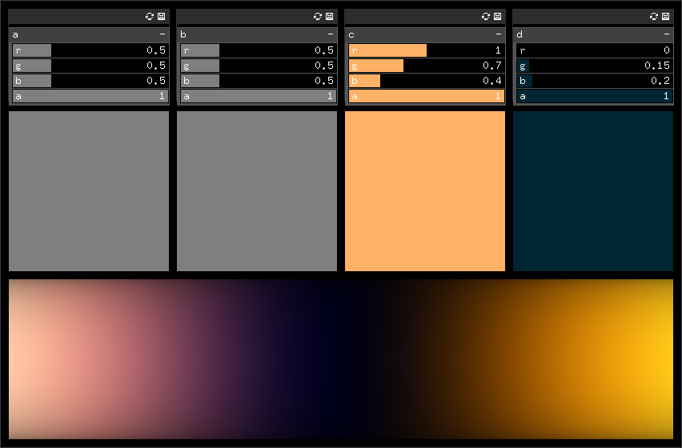

Color palette
=============

This is a small openFrameworks program that displays a procedural color palette as described in Iñigo Quilez's [article](http://iquilezles.org/www/articles/palettes/palettes.htm).

Compatibility
-------------

Works with oF 0.8.4 and Linux.